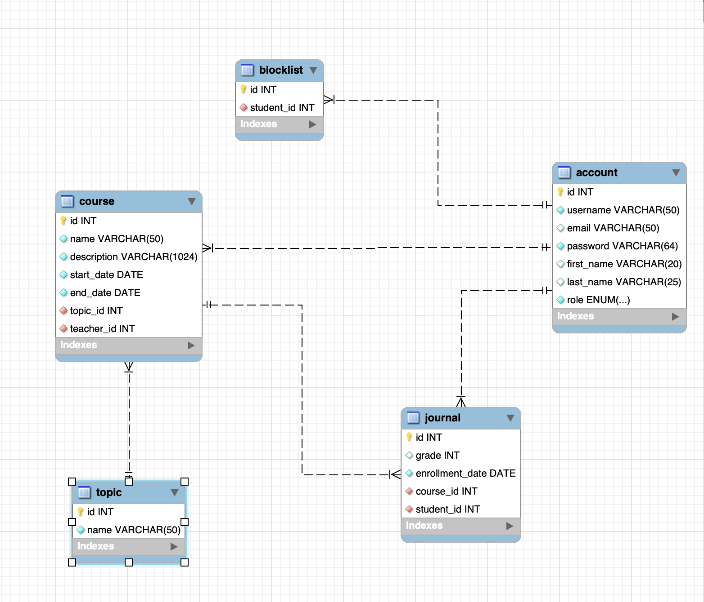

# Elective
The project represents courses app with 3 roles: Admin, Teacher and Student. Each of them has personal account that they can log in to using email/username and password.

## Database schema

### Admin can do the following actions:
* Register teachers and assign courses to them
* Create, edit, delete courses
* Select certain courses by different criteria. This implies sort and filter by teacher or topic
* Block/unlock the students
* Sign in to admin account using login 'administrator' and password 'Admin123'

### Teacher:
* Has personal account that displays info about courses he/she teaches
* Can students assigned to courses
* Can grade students' courses

### Student
* When logs in, available courses (i.e. courses he/she can join) are displayed
* Can view registered courses
* Can view ongoing courses
* Can view completed courses and their grades
* If blocked, cannot log in

### The following programmatic features are incorporated into the project:
* Field validation (Frontend JS)
* Data Access Object Factory (allows to easily switch between different dbms)
* Localization (app supports both english and cyrillic version)
* Session, where info about logged in user is stored
* Request filters for authentication and authorization (which means that you are prohibited or allowed to access certain resources)
* JDBC as means to perform operations an database
* Password hashing using BCrypt library
* Logging to the file using Log4J2
* App Listener that listens to different events related to app lifecycle

### App architecture:
* MVC pattern
* Servlets act as an intermediary between view and model
* View layer is composed of jsp pages
* Model layer contains entities (Business entities implemented in form of classees), service classes (that perform app-specific business logic),
  DAO layer with methods that directly access database, and helper classes such as mappers that help read data from requests or db
* Overall structure looks like this: View (Jsp pages) -> Controller (servlets) -> Business logic (service) -> Database Access (DAO)
